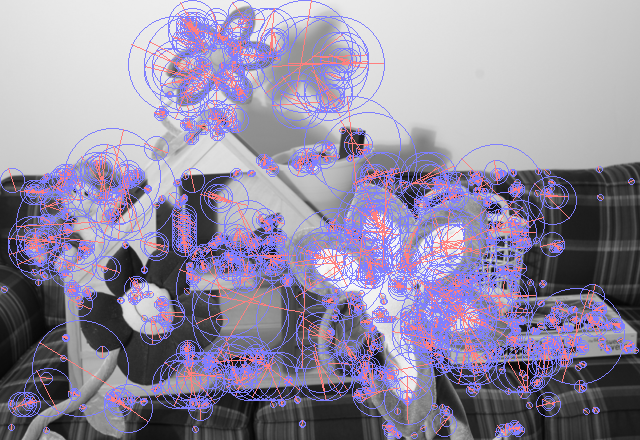

Working towards an implementation of ORB
https://en.wikipedia.org/wiki/Oriented_FAST_and_rotated_BRIEF
http://www.gwylab.com/download/ORB_2012.pdf ORB: an efficient alternative to SIFT or SURF

status:
* Binomial filtered Pyramid construction
* Corner detection using FAST
* Corner scoring and selection using Harris score
* Corner orientation using image moments
* Corner description as 128 bit rBrief Hamming Code

source images from https://vision.middlebury.edu/stereo/data/scenes2014/
