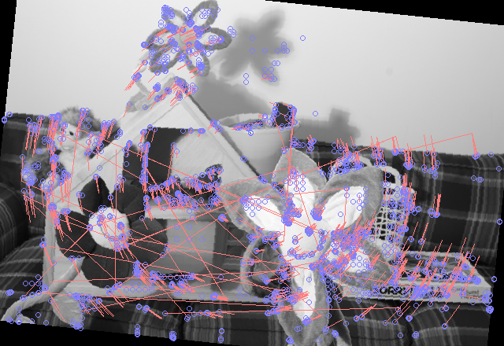

Working towards an implementation of [ORB](https://en.wikipedia.org/wiki/Oriented_FAST_and_rotated_BRIEF) in Rust.

Original paper:
[ORB: an efficient alternative to SIFT or SURF](http://www.gwylab.com/download/ORB_2012.pdf)

status:
* Binomial filtered Pyramid construction
* Corner detection using FAST
* Corner scoring and selection using Harris score
* Corner orientation using image moments
* Corner description as 128 bit rBrief Hamming Code
* Corner matching using Locality Sensitive Hash for Nearest Neighbour lookup

Examples:

Detected image features with scale and orientation

Detected matches with hamming distance < 15 on synthetic rotation

source images from https://vision.middlebury.edu/stereo/data/scenes2014/
